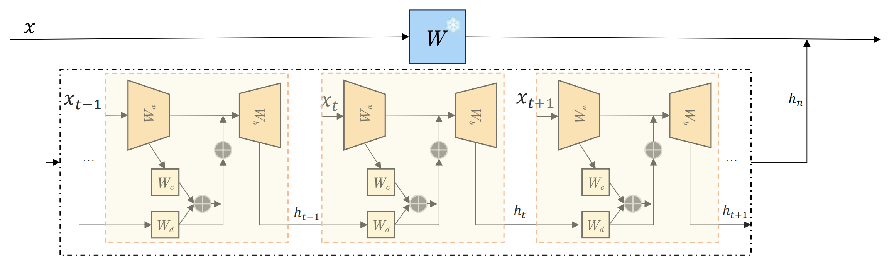

# SSMLoRA
🎉🎉🎉 NAACL 2025 main conference paper: SSMLoRA: Enhancing Low-Rank Adaptation with State Space Model

## Overview



## Setup

```
conda create -n ssmlora python=3.10
pip install -r requirements.txt
```

## Train

```
python src/main.py --dataset BoolQ
```

### Citation

```
@misc{yu2025ssmlora,
      title={SSMLoRA: Enhancing Low-Rank Adaptation with State Space Model}, 
      author={Jiayang Yu and Yihang Zhang and Bin Wang and Peiqin Lin and Yongkang Liu and Shi Feng},
      year={2025},
      archivePrefix={arXiv},
      primaryClass={cs.CL}
}

```
