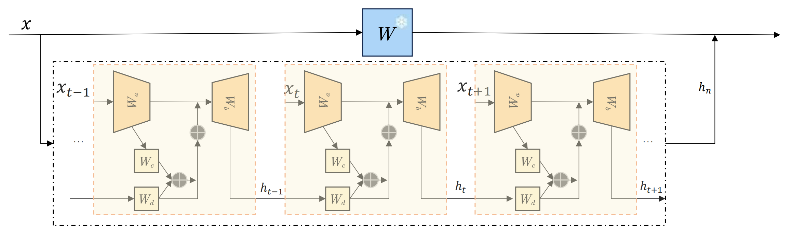

# SSMLoRA
🎉🎉🎉 NAACL 2025 main conference paper: SSMLoRA: Enhancing Low-Rank Adaptation with State Space Model

## Overview



## Setup

```
conda create -n ssmlora python=3.10
pip install -r requirements.txt
```

## Train

```
python src/main.py --dataset BoolQ
```

### Citation

```
@inproceedings{yu2025ssmlora,
  title={SSMLoRA: Enhancing Low-Rank Adaptation with State Space Model},
  author={Yu, Jiayang and Zhang, Yihang and Wang, Bin and Lin, Peiqin and Liu, Yongkang and Feng, Shi},
  booktitle={Proceedings of the 2025 Conference of the Nations of the Americas Chapter of the Association for Computational Linguistics: Human Language Technologies (Volume 1: Long Papers)},
  pages={4493--4506},
  year={2025}
}
```
